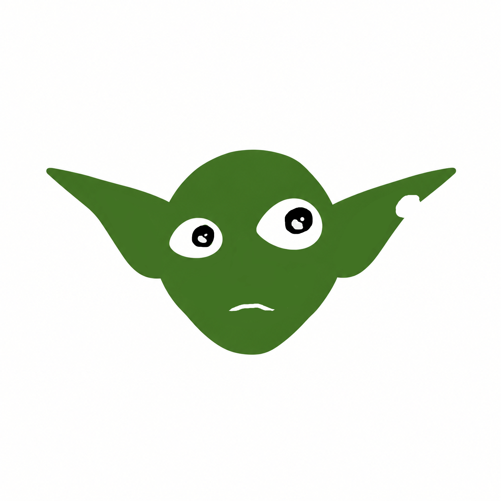

# Goblin Yapper

> **English:** the English version of this README is [further down this page](#english).

Um app para lives na Twitch: o chat entra numa fila com `!joinsort`, você sorteia os times, e quem você escolhe
**ganha a voz**: as mensagens dessa pessoa são lidas em voz alta e o goblin do time dela fala na tela do OBS.

- **Sorteio de times**: até 4 times (azul, verde, roxo, amarelo), equilibrados; dá para arrastar pessoas entre
  times, sortear de novo e incluir quem chegar atrasado.
- **Voz**: dê a voz a alguém aleatório de um time, ao próximo do mesmo time ou a uma pessoa específica.
  As vozes podem ser clonadas a partir de um áudio seu (OmniVoice, rodando na sua GPU).
- **Overlay do OBS**: um goblin por time, tingido com a cor do time, que se mexe enquanto fala. Use o goblin
  embutido ou as suas próprias imagens (png parado + gif falando).

Lê o chat de forma anônima: não precisa fazer login na Twitch.

## Download e instalação

1. Baixe o instalador `.msi` da [página de releases](https://github.com/NegentropyBeing/goblin-yapper/releases/latest).
2. Abra o arquivo. O instalador não é assinado, então o Windows SmartScreen pode avisar:
   clique em **Mais informações → Executar assim mesmo**.

Requisitos:
- Windows 10 ou 11 (64 bits).
- Para a voz clonada (OmniVoice): uma GPU NVIDIA é recomendada (testado numa RTX 5070) e cerca de 11 GB livres
  em disco. Sem GPU ela roda no processador, bem devagar. As vozes do Windows funcionam em qualquer PC.

## Como usar

1. **Conecte ao chat**: digite o nome do canal (ou cole o link) no campo **canal da twitch** e clique em
   **Conectar**.
2. **Monte os times**: escolha quantos times, clique em **Abrir fila** e peça para o chat digitar `!joinsort`.
   Clique em **Sortear**. Depois disso, quem entrar vai direto para o menor time.
3. **Dê a voz**: clique em **🎤 Sortear voz** em um time (pessoa aleatória daquele time) ou no 🎤 ao lado de
   um nick (aquela pessoa). **⏭ Próximo** passa a voz para outra pessoa do mesmo time e **⏹ Parar** tira a voz
   do time; **Parar voz**, no topo, corta tudo.
   Com **vários times ao mesmo tempo** ligado, cada time pode ter alguém com a voz; as falas tocam uma de cada vez.
4. **Coloque no OBS**: abra **Overlay do OBS e imagens do goblin**, copie a URL do overlay e adicione uma
   **Fonte de navegador** no OBS com ela.
5. **Configure a voz** (aba **Voz**): na primeira vez, clique em **Instalar servidor de voz**. Ele baixa tudo
   o que precisa (~3,5 GB, mais ~3 GB do modelo ao iniciar pela primeira vez); não é preciso instalar Python.
   Depois, crie perfis de voz e escolha qual perfil cada time usa.

### Comandos do chat

| comando | o que faz |
|---------|-----------|
| `!joinsort` ou `!joinsorting` | Entra na fila (só com a fila aberta). Depois do sorteio, entra direto no menor time. |
| `!leavesort` | Sai da fila ou do time. |

Quem está com a voz não digita comando: as mensagens normais são lidas. Mensagens que começam com `!`, links e
emotes não são lidos, e no máximo 5 mensagens ficam esperando; o resto é descartado.

### OBS

- URL do overlay: `http://127.0.0.1:8765/overlay` (fundo transparente). O app precisa estar aberto.
- Um goblin por fonte: `?team=azul&audio=0`, uma fonte por time; deixe só **uma** fonte com o áudio ligado.
- Outras opções: `?size=400` (tamanho), `?label=0` (esconde o nick).
- Ative "Controlar áudio pelo OBS" na fonte para ter a voz num canal próprio do mixer.
- O painel também funciona como dock personalizado do OBS: `http://127.0.0.1:8765/panel`.

### Imagens do goblin

Na seção **Overlay do OBS e imagens do goblin**, arraste um `goblin.png` (parado) e um `goblin.gif` (falando).
Cada time recebe o mesmo goblin tingido com a sua cor; ajuste a cor e a intensidade da tinta em cada time.
Um goblin neutro ou acinzentado fica melhor tingido. Imagens próprias de um time (`azul.png` / `azul.gif`)
substituem as compartilhadas. Sem imagens, é usado o goblin embutido.

### Perfis de voz

Na aba **Voz**, arraste um `.wav` com a voz a clonar. O app prepara o áudio (corta silêncio, normaliza),
transcreve com o Whisper, e você revisa a transcrição antes de criar o perfil. Dá para testar frases, ajustar
todos os parâmetros do OmniVoice (idioma, velocidade, ...) para todos os perfis ou para um só, e escolher a voz
de cada time. As vozes do Windows também estão disponíveis como alternativa.

**Só clone vozes com a permissão de quem fala.**

## Onde ficam os dados

- Configurações, imagens, perfis de voz e log: `%APPDATA%\com.goblinyapper.desktop\` (o painel mostra a pasta
  em **Pasta de dados**).
- Servidor de voz: `%LOCALAPPDATA%\GoblinYapper\voice-runtime\`; o modelo fica no cache do Hugging Face.
- Desinstalar o app mantém essas pastas. Apague-as para remover tudo.

## Desenvolvimento

Para rodar a partir do código-fonte, gerar o instalador, usar a API HTTP ou trocar a engine de TTS, veja
[docs/DEVELOPMENT.md](docs/DEVELOPMENT.md). Notas de design originais: [docs/SPEC.md](docs/SPEC.md).

## Licença

O código do Goblin Yapper é **MIT** (veja [LICENSE](LICENSE)). Modelos e bibliotecas de terceiros são baixados
separadamente e mantêm as suas próprias licenças; veja o [NOTICE](NOTICE).

- **OmniVoice** (k2-fsa): código Apache-2.0; o **modelo pré-treinado é CC-BY-NC, somente uso não comercial**.
  Usar a voz do OmniVoice em lives monetizadas pode contar como uso comercial; confira os termos do modelo.
  As vozes do Windows não têm essa restrição.
- O tokenizador de áudio do modelo OmniVoice (atribuição exigida, mantida no original em inglês):
  **Built with Higgs Materials licensed from Boson AI USA, Inc., Copyright Boson AI USA, Inc., All Rights
  Reserved and Meta Llama 3 licensed under the Meta Llama 3 Community License, Copyright Meta Platforms, Inc.,
  All Rights Reserved.** Os contratos estão em [third_party/](third_party/); o uso deve seguir a
  [Política de Uso Aceitável do Meta Llama 3](https://llama.meta.com/llama3/use-policy).
- **Whisper** (OpenAI, transcrição): MIT.

---

# English

A Twitch streaming app: chat joins a queue with `!joinsort`, you sort them into teams, and whoever you pick
**gets the voice**: their messages are read aloud and their team's goblin talks on your OBS scene.

- **Team sorter**: up to 4 balanced teams (azul, verde, roxo, amarelo — blue, green, purple, yellow); drag
  people between teams, re-sort, and late joiners are added automatically.
- **Voice**: give the voice to a random person on a team, the next one on the same team, or a specific person.
  Voices can be cloned from your own audio (OmniVoice, running on your GPU).
- **OBS overlay**: one goblin per team, tinted with the team color, that moves while it talks. Use the built-in
  goblin or your own images (idle png + talking gif).

Chat is read anonymously: no Twitch login needed. The app's interface is in Portuguese (pt-BR).

## Download and install

1. Download the `.msi` installer from the [releases page](https://github.com/NegentropyBeing/goblin-yapper/releases/latest).
2. Run it. The installer is unsigned, so Windows SmartScreen may warn you: click **More info → Run anyway**.

Requirements:
- Windows 10 or 11 (64-bit).
- For the cloned voice (OmniVoice): an NVIDIA GPU is recommended (tested on an RTX 5070) and about 11 GB of free
  disk space. Without a GPU it runs on the CPU, slowly. Windows voices work on any PC.

## How to use

1. **Connect to chat**: type the channel name (or paste its link) in the **canal da twitch** field and click
   **Conectar**.
2. **Build the teams**: pick how many teams, click **Abrir fila** (open queue) and ask chat to type `!joinsort`.
   Click **Sortear** (sort). After that, anyone who joins goes straight to the smallest team.
3. **Give the voice**: click **🎤 Sortear voz** on a team (random person from that team) or the 🎤 next to a
   name (that person). **⏭ Próximo** passes the voice to someone else on the same team and **⏹ Parar** takes it
   from the team; **Parar voz**, at the top, stops everything.
   With **vários times ao mesmo tempo** (several teams at once) on, each team can have a speaker; lines play one
   at a time.
4. **Add it to OBS**: open **Overlay do OBS e imagens do goblin**, copy the overlay URL and add a
   **Browser Source** in OBS with it.
5. **Set up the voice** (**Voz** tab): the first time, click **Instalar servidor de voz** (install voice server).
   It downloads everything it needs (~3.5 GB, plus ~3 GB for the model on first start); no Python install
   needed. Then create voice profiles and choose which profile each team uses.

### Chat commands

| command | what it does |
|---------|--------------|
| `!joinsort` or `!joinsorting` | Join the queue (only while it's open). After the sort, join the smallest team directly. |
| `!leavesort` | Leave the queue or team. |

Whoever has the voice doesn't type a command: their normal messages are read. Messages starting with `!`, links
and emotes are skipped, and at most 5 messages wait in line; the rest are dropped.

### OBS

- Overlay URL: `http://127.0.0.1:8765/overlay` (transparent background). The app must be open.
- One goblin per source: `?team=azul&audio=0`, one source per team; keep audio on in only **one** source.
- Other options: `?size=400` (size), `?label=0` (hide the name).
- Enable "Control audio via OBS" on the source to put the voice on its own mixer channel.
- The panel also works as an OBS custom dock: `http://127.0.0.1:8765/panel`.

### Goblin images

In **Overlay do OBS e imagens do goblin**, drop a `goblin.png` (idle) and a `goblin.gif` (talking). Each team
gets the same goblin tinted with its color; set each team's tint color and strength. A neutral or grayish goblin
tints best. A team's own images (`azul.png` / `azul.gif`) override the shared ones. Without images, the built-in
goblin is used.

### Voice profiles

In the **Voz** tab, drop a `.wav` of the voice to clone. The app prepares the audio (trims silence, normalizes),
transcribes it with Whisper, and you review the transcript before creating the profile. You can test lines,
tune every OmniVoice parameter (language, speed, ...) for all profiles or just one, and pick each team's voice.
Windows voices are also available as an alternative.

**Only clone voices with the speaker's permission.**

## Where your data lives

- Settings, images, voice profiles and log: `%APPDATA%\com.goblinyapper.desktop\` (the panel shows it under
  **Pasta de dados**).
- Voice server: `%LOCALAPPDATA%\GoblinYapper\voice-runtime\`; the model lives in the Hugging Face cache.
- Uninstalling the app keeps these folders. Delete them to remove everything.

## Development

To run from source, build the installer, use the HTTP API or swap the TTS engine, see
[docs/DEVELOPMENT.md](docs/DEVELOPMENT.md). Original design notes: [docs/SPEC.md](docs/SPEC.md).

## License

Goblin Yapper's code is **MIT** (see [LICENSE](LICENSE)). Third-party models and libraries are downloaded
separately and keep their own licenses; see [NOTICE](NOTICE).

- **OmniVoice** (k2-fsa): code Apache-2.0; the **pre-trained model is CC-BY-NC, non-commercial use only**.
  Using the OmniVoice voice on monetized streams may count as commercial use; check the model's terms.
  Windows voices don't have this restriction.
- The OmniVoice model's audio tokenizer: **Built with Higgs Materials licensed from Boson AI USA, Inc.,
  Copyright Boson AI USA, Inc., All Rights Reserved and Meta Llama 3 licensed under the Meta Llama 3
  Community License, Copyright Meta Platforms, Inc., All Rights Reserved.** Agreements in
  [third_party/](third_party/); use must follow the
  [Meta Llama 3 Acceptable Use Policy](https://llama.meta.com/llama3/use-policy).
- **Whisper** (OpenAI, transcription): MIT.
